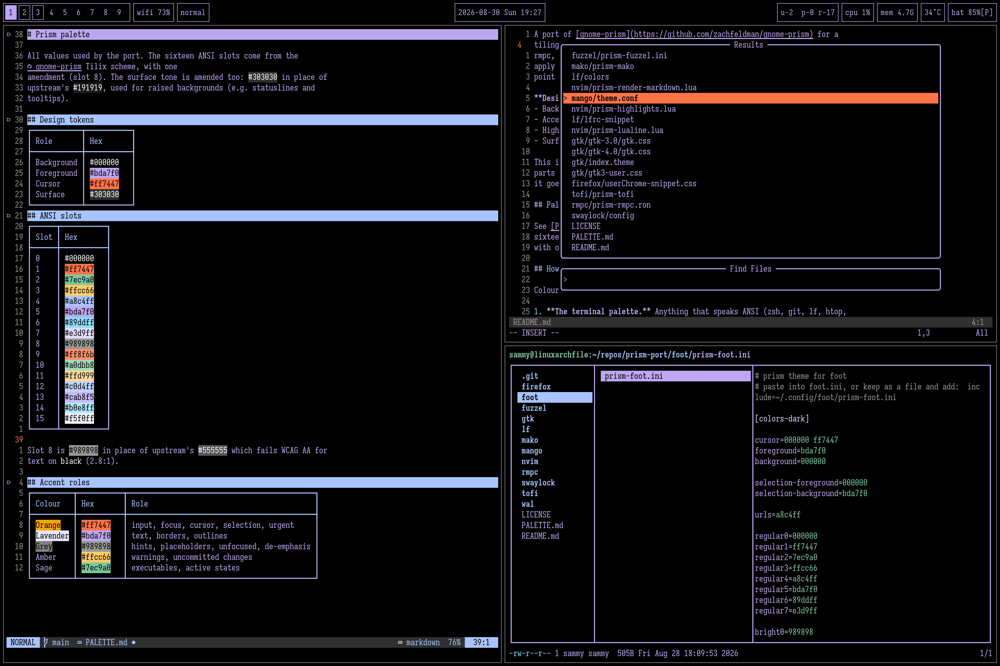
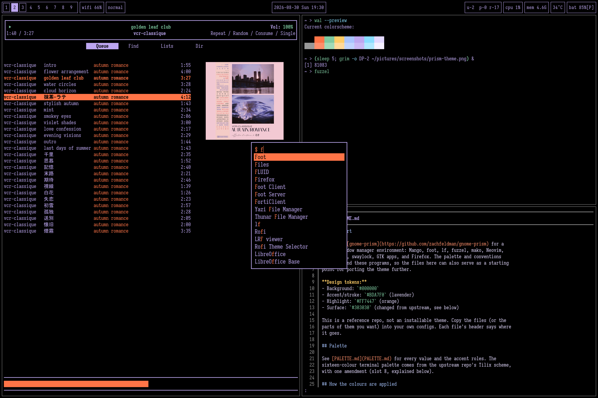
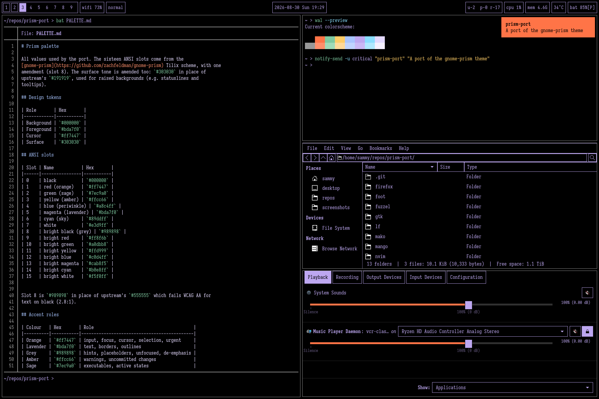

# prism-port

A port of [gnome-prism](https://github.com/zachfeldman/gnome-prism) for a
tiling window manager environment: Mango, foot, lf, fuzzel, mako, Neovim,
rmpc, tofi, swaylock, GTK apps, and Firefox. The palette and conventions
apply beyond these programs, so the files here can also serve as a starting
point for porting the theme further.

**Design tokens:**
- Background: `#000000`
- Accent/stroke: `#BDA7F0` (lavender)
- Highlight: `#FF7447` (orange)
- Surface: `#303030` (changed from upstream, see below)

This is a reference repo, not an installable theme. Copy the files (or the
parts of them you want) into your own configs. Each file's header says where
it goes.

## Palette

See [PALETTE.md](PALETTE.md) for every value and the accent roles. The
sixteen-colour terminal palette comes from the upstream repo's Tilix scheme,
with one amendment (slot 8, explained below).

## How the colours are applied

Colours are applied in one of three ways:

1. **The terminal palette.** Anything that speaks ANSI (zsh, git, lf, htop,
   and most TUIs) picks up the palette directly from the terminal.
2. **Per-program colour files** for programs with their own colour configs:
   the static `prism-*` files in each program's directory, or, with pywal16,
   the wal templates in `wal/`.
3. **GTK theme css** for GTK apps, plus a user css file with further fixes.

## Install

### Static files

Copy the file from each program's directory and follow its header comment.

Notes:

- **foot:** paste `foot/prism-foot.ini` into `foot.ini` or include it. The
  `[colors-dark]` section needs foot 1.23 or newer. For older versions rename
  it `[colors]`. If foot runs as a server, restart it (`pkill -x foot`) to
  pick up changes.
- **fuzzel:** paste into `fuzzel.ini` or include under `[main]`.
- **mako:** paste or include, then `makoctl reload`.
- **mango:** save `mango/theme.conf` and source it from `config.conf`.
  Colours are `0xRRGGBBAA`. The translucent `dropcolor` is deliberate.
- **lf:** `lf/colors` is a complete drop-in (symlinks in amber, everything
  else follows the terminal palette). `lf/lfrc-snippet` has one line for the
  error message style.
- **rmpc:** save `rmpc/prism-rmpc.ron` as `~/.config/rmpc/themes/prism.ron`
  and set `theme: "prism"` in `config.ron`.
- **tofi:** merge the colour keys from `tofi/prism-tofi` into your config.
  For a floating tofi, `border-width = 1` with `border-color = #bda7f0`
  matches the port's outlines.
- **swaylock:** `swaylock/prism-swaylock` is a complete config: black field,
  lavender ring, orange key flashes.
- **nvim:** `nvim/prism-highlights.lua` goes in a ColorScheme autocmd (or
  after your colorscheme call). `nvim/prism-lualine.lua` patches your lualine
  theme before setup. `nvim/prism-render-markdown.lua` joins the same
  autocmd. Telescope has no selection-aware match group so matches there are
  bold-only (a known deviation from the picker grammar).
- **GTK:** copy `gtk/themes/gnome-prism/` to `~/.local/share/themes/`, then
  set the theme name and dark preference. On many Wayland sessions dconf
  outranks `settings.ini`, so set both:

      gsettings set org.gnome.desktop.interface gtk-theme 'gnome-prism'
      gsettings set org.gnome.desktop.interface color-scheme 'prefer-dark'

  Add `gtk/gtk3-user.css` as `~/.config/gtk-3.0/gtk.css` (further fixes:
  selection visibility, separators, spinner, tooltips). For GTK4 apps,
  symlink the theme's stylesheet:
  `ln -sf ~/.local/share/themes/gnome-prism/gtk-4.0/gtk.css
  ~/.config/gtk-4.0/gtk.css`. File pickers and other portal dialogs only
  pick up changes after
  `systemctl --user restart xdg-desktop-portal-gtk xdg-desktop-portal`.
- **Firefox:** `firefox/userChrome-snippet.css` styles the overlays Firefox
  draws itself: surface-toned tooltips, popup panels, and the urlbar
  dropdown. Restart Firefox after userChrome changes.
- **bat:** bat renders its themes as truecolor and ignores the terminal
  palette. Set `--theme="base16"` in `~/.config/bat/config` to make it
  follow prism.

### With pywal16

Inside `wal/`, the `colorschemes` and `templates` directories match their
`~/.config/wal/` counterparts. Copy `colorschemes/dark/prism.json` and the
contents of `templates/` into the same paths there, then:

    wal --theme prism

The templates cover foot, fuzzel, mako, and rmpc. wal renders each template
into `~/.cache/wal/`, and the configs for those four programs then include
or reference the rendered file there, rather than the static file from this
repo.

Everything else follows the static-files section above; those files are not
generated by wal and are the same on both routes.

One exception: for nvim, use the plugin specs in `wal/nvim/` (colorscheme,
lualine, render-markdown) instead of the lualine and render-markdown
snippets. `nvim/prism-highlights.lua` still applies as-is. The `wal/nvim/`
specs need the [pywal16.nvim](https://github.com/uZer/pywal16.nvim)
colorscheme, which `wal/nvim/pywal16.lua` installs.

Remember to edit templates, never the cache. Every wal run rebuilds the
cache from the templates, so changes made in `~/.cache/wal/` are
overwritten.

For Firefox, [pywalfox](https://github.com/Frewacom/pywalfox) themes the
browser UI from the palette, with the userChrome snippet supplementing the
surface tone, which pywalfox has no slot for.

## Departures from upstream

### Palette

- **Slot 8 (bright-black):** changed from `#555555` to `#989898`. Upstream's
  value fails WCAG even at AA (2.8:1 on black), leaving comments and dimmed
  text somewhat hard to read. `#989898` is
  [modus-vivendi](https://protesilaos.com/emacs/modus-themes)'s comment
  grey, AAA at 7.3:1.
- **Symlinks:** ANSI 33 (amber) in lf. The terminal palette left symlinks on
  cyan, which is very close to the periwinkle directories. Amber is warm
  enough to separate cleanly.

### Surface

- **Surface changed from `#191919` to `#303030` throughout.** gnome-prism's
  surface works only alongside its lavender strokes. Used alone (statusline,
  hover states, tooltips), a 10% lift on black is imperceptible. `#303030`
  matches modus-vivendi's value for the same element class.

### Typography

- **Hardcoded fonts removed from the GTK theme** (the `font-family` lines in
  both css files). Font choice is left to GTK's font setting and to each
  program's own config.

### GTK

The GTK3 fixes are a separate file (`gtk3-user.css`, to be saved as
`~/.config/gtk-3.0/gtk.css`), which GTK loads on top of whatever theme is
active. The GTK4 fixes are edits made directly to the theme's own
`gtk-4.0/gtk.css`.

**GTK3:**

- Selection: black-on-lavender `:selected` rules for rows, lists, and tree
  views.
- Separators: lavender, including paned dividers.
- Spacing: padding added to headerbars and the file chooser's path-bar
  chips.
- Spinner: hidden when idle, lavender and animated when active.
- Tooltips: surface tone with a lavender border.

**GTK4:**

- Colour variables flattened to literal hex, as `@define-color` is
  deprecated in current GTK4 and its rules were not applying reliably here.
- Containers (window, box, stack, notebook, scrolledwindow, viewport) set to
  black.
- Tab strip set to black, active tab filled lavender with black text.
- Sliders set to orange up to the current level and grey beyond it, with a
  lavender handle. Level indicators (GTK levelbars) set to lavender.
